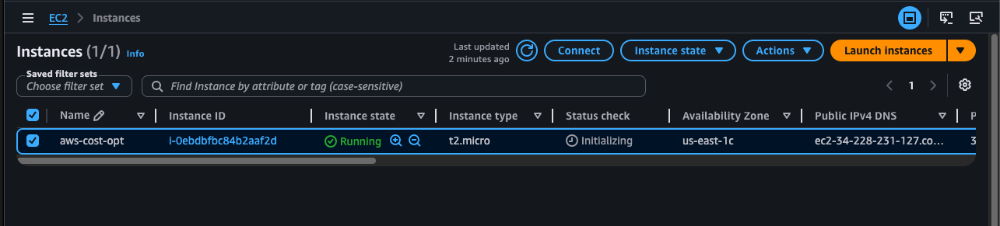
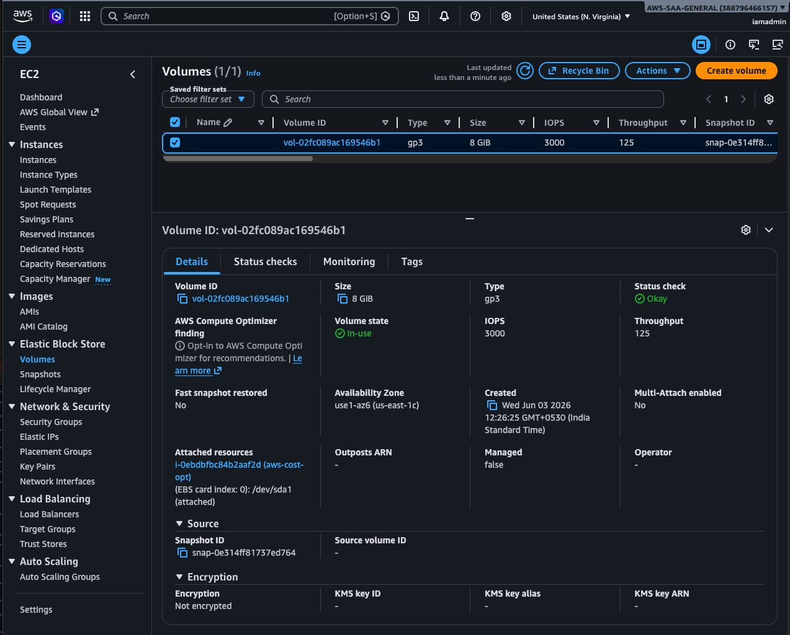
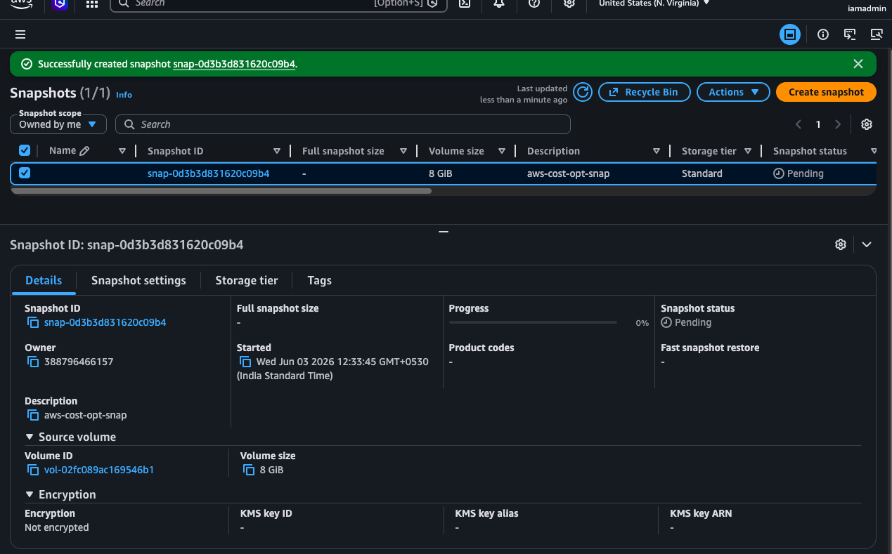
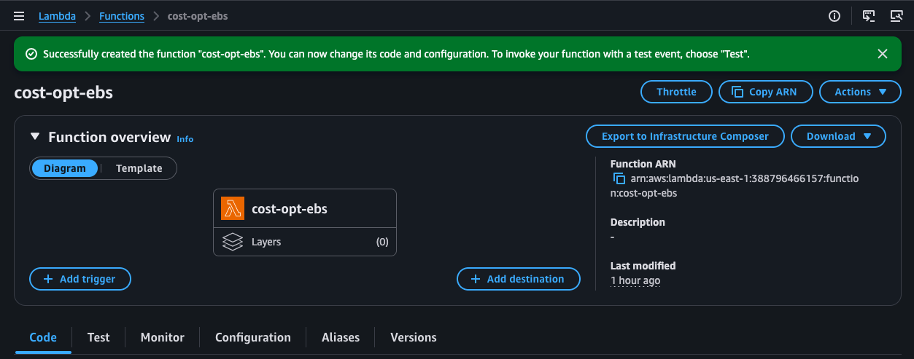
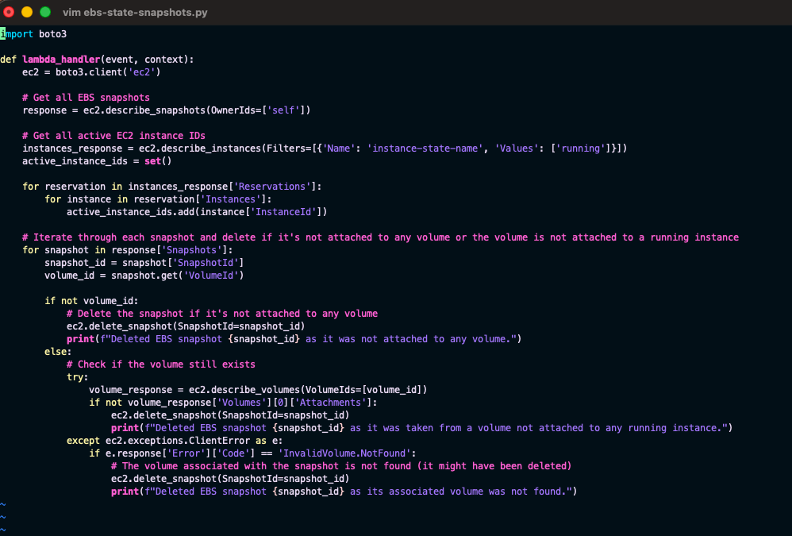
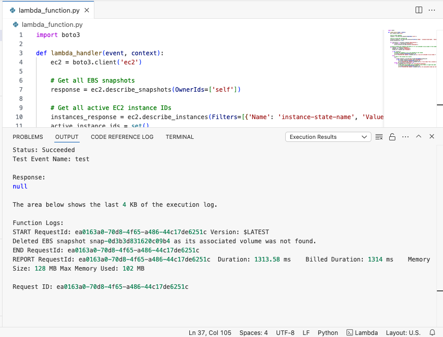
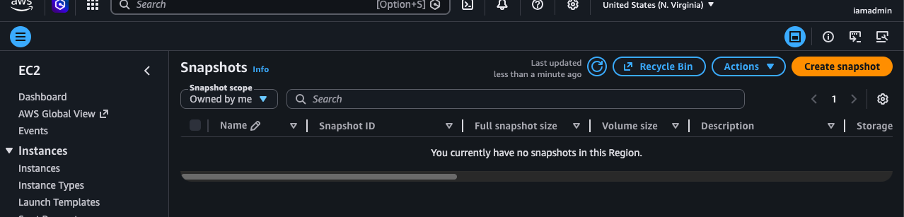

# AWS Cloud Cost Optimization - Identifying Stale EBS Snapshots

## Objective

The objective of this project is to automate the identification and deletion of stale Amazon EBS snapshots using AWS Lambda and Python (Boto3).

Stale snapshots are snapshots whose associated EBS volumes are no longer attached to active EC2 instances.

---

# Architecture


---

# Step 1 - Launch EC2 Instance

Navigate to:

EC2 Dashboard → Instances → Launch Instance

Configuration:

- Ubuntu
- t2.micro
- Default Security Group

Launch the instance.



---

# Step 2 - Verify EBS Volume

An EBS volume is automatically created and attached to the EC2 instance.

Navigate to:

EC2 Dashboard → Elastic Block Store → Volumes

Verify the attached volume.



---

# Step 3 - Create EBS Snapshot

Navigate to:

EC2 Dashboard → Snapshots

Create a snapshot from the attached volume.



---

# Step 4 - Create Lambda Function

Navigate to:

AWS Lambda → Create Function

Configuration:

- Author from Scratch
- Runtime: Python
- Default Permissions

Create the function.



---

# Step 5 - Upload Python Code

Paste the Lambda code into the function editor.

Deploy the function.



---

# Step 6 - Initial Testing

Execute a test event.

The first execution failed because Lambda exceeded the default execution timeout.

Error:

Task timed out after 3.00 seconds

---

# Step 7 - Increase Lambda Timeout

Navigate to:

Configuration → General Configuration

Update timeout from:

3 Seconds → 10 Seconds

Save the configuration.


---

# Step 8 - Configure IAM Permissions

Navigate to:

Lambda → Configuration → Permissions

Open the attached IAM role.

Create a custom policy with:

```json
{
  "Version": "2012-10-17",
  "Statement": [
    {
      "Effect": "Allow",
      "Action": [
        "ec2:DescribeSnapshots",
        "ec2:DeleteSnapshot"
      ],
      "Resource": "*"
    }
  ]
}
```
Attach the policy.


---

# Step 9 - Resolve Authorization Error

The next execution produced an authorization error.

### Error

```text
UnauthorizedOperation when calling DescribeInstances
```

### Root Cause

The Lambda execution role lacked additional EC2 read permissions.

### Solution

Added the following permissions to the IAM policy:

```json
{
  "Effect": "Allow",
  "Action": [
    "ec2:DescribeInstances",
    "ec2:DescribeVolumes"
  ],
  "Resource": "*"
}
```

Updated the IAM policy and attached it to the Lambda execution role.


---

# Step 10 - Re-Test Lambda

Execute the Lambda function again.

The function successfully scanned EBS snapshots and EC2 resources without any authorization errors.



---

# Step 11 - Simulate a Stale Snapshot

To test the cleanup logic, terminate the EC2 instance.

When the instance is terminated:

- The associated EBS volume is automatically deleted.
- The snapshot remains in the account.
- This creates a stale snapshot scenario.

---

# Step 12 - Execute Cleanup

Run the Lambda function again.

### Result

- Snapshot identified
- Associated volume not found
- Snapshot deleted successfully



---

# Step 13 - Cleanup Resources

Delete all resources created for this project:

- IAM Policy
- IAM Role
- Lambda Function

Finally, verify that all project resources have been removed from the AWS account.

# Project Validation

### The Lambda function successfully:

- Identified stale snapshots
- Verified volume associations
- Deleted unnecessary snapshots
- Logged execution details to CloudWatch
- Reduced unnecessary storage consumption

# Conclusion

This project demonstrates a practical AWS cost optimization strategy using serverless automation. By automatically identifying and deleting stale EBS snapshots, organizations can reduce storage costs while maintaining a clean and efficient AWS environment.
