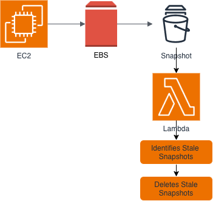

# AWS Cloud Cost Optimization - Identifying Stale EBS Snapshots

## Project Overview

This project demonstrates how AWS Lambda can be used to automate cloud cost optimization by identifying and deleting stale Amazon EBS snapshots that are no longer associated with active EC2 instances.

As cloud environments grow, unused snapshots can accumulate and continue generating storage costs. This serverless solution automatically detects such snapshots and removes them, helping reduce unnecessary AWS spending.

---

## Architecture



## Repository Structure

```
AWS-Cloud-Cost-Optimization
├── architecture
│   └── architecture.png
├── docs
│   ├── lessons-learned.md
│   └── troubleshooting.md
├── HOWTO.md
├── README.md
├── screenshots
│   ├── 01-ec2-instance.png
│   ├── 02-ebs-volume.png
│   ├── 03-snapshot-created.png
│   ├── 04-lambda-function.png
│   ├── 05-lambda-code.png
│   ├── 06-deploy-success.png
│   ├── 07-iam-role.png
│   ├── 08-lambda-test-success.png
│   └── 09-snapshot-deleted.png
└── src
    └── ebs-state-snapshots.py
```

### Workflow

1. Lambda retrieves all EBS snapshots owned by the AWS account.
2. Lambda retrieves all active EC2 instances.
3. Lambda checks whether each snapshot's volume is associated with any active EC2 instance.
4. Snapshots associated with deleted volumes are identified as stale.
5. Stale snapshots are deleted.

---

## AWS Services Used

- AWS Lambda
- Amazon EC2
- Amazon EBS
- AWS IAM
- Boto3 (AWS SDK for Python)

---

## Skills Demonstrated

- AWS Lambda Development
- Python Automation
- Boto3 SDK
- IAM Policy Configuration
- Cost Optimization Strategies
- Troubleshooting AWS Permissions
- Infrastructure Automation

---

## Project Outcomes

- Automated stale snapshot detection
- Automated snapshot cleanup
- Reduced unnecessary storage costs
- Improved cloud resource governance

---

## Author

**Raghu Vikas Reddy Yadavalli**

Cloud & DevOps Engineer
